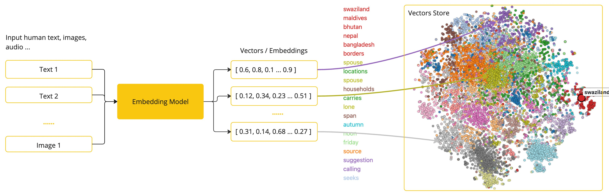

# AI Concepts
This section describes core concepts that Spring AI uses. We recommend reading it closely to understand the ideas behind how Spring AI is implemented.   
这个章节描述Spring AI使用的核心概念。我们建议你仔细地阅读它，以理解Spring AI实现背后的思想。


## Models
## 模型
AI models are algorithms designed to process and generate information, often mimicking human cognitive functions. By learning patterns and insights from large datasets, these models can make predictions, text, images, or other outputs, enhancing various applications across industries.   
人工智能模型是被设计用于处理和生成信息的算法，通常模仿人类的认知功能。通过从大量的数据集中学习模式和简洁，这些模型可以进行预测、生成文本、生成图片或其他的输出，从而增强跨行业的各种应用。

There are many different types of AI models, each suited for a specific use case. While ChatGPT and its generative AI capabilities have captivated users through text input and output, many models and companies offer diverse inputs and outputs. Before ChatGPT, many people were fascinated by text-to-image generation models such as Midjourney and Stable Diffusion.   
这里有很多不同类型的AI模型，每个模型都适合特定的用例。尽管ChatGPT和它的生成式AI通过文本输入和输出吸引了用户，但许多模型和公司提供了多样化的输入和输出。在ChatGPT之前，许多人被文本到图像生成模型如Midjourney和Stable Diffusion所吸引。

The following table categorizes several models based on their input and output types:   
下面的表格根据它们的输入和输出类型对几个模型进行了分类：


Spring AI currently supports models that process input and output as language, image, and audio. The last row in the previous table, which accepts text as input and outputs numbers, is more commonly known as embedding text and represents the internal data structures used in an AI model. Spring AI has support for embeddings to enable more advanced use cases.   
Spring AI目前支持处理输入输出为自然语言，图片和声音的模型。在上面表格的最后一行，它接收文本作为输入并输出数字，通常被称为嵌入文本（embedding text）它代表了被用于一个AI模型的内部数据结构。Spring AI支持嵌入（embeddings）以启用更高级的用例。

What sets models like GPT apart is their pre-trained nature, as indicated by the "P" in GPT—Chat Generative Pre-trained Transformer. This pre-training feature transforms AI into a general developer tool that does not require an extensive machine learning or model training background.   
使像GPT这样的模型与从不同的是它们预训练的特性，正如在GPT中的"P"所指示的-聊天生成预训练Transformer。这种预训练特性将 AI 转化为不需要广泛机器学习或模型训练背景的通用开发者工具。


## Prompts
## 提示词
Prompts serve as the foundation for the language-based inputs that guide an AI model to produce specific outputs. For those familiar with ChatGPT, a prompt might seem like merely the text entered into a dialog box that is sent to the API. However, it encompasses much more than that. In many AI Models, the text for the prompt is not just a simple string.   
提示词作为基于语言的的输入基础，这些输入指导AI模型产生特定的输出。对于那些熟悉ChatGPT的人来说，一个提示词似乎看起来仅仅像文本输入到一个对话框中并发给API。然而，它包含的东西远远不止这些。在许多AI模型中，提示词的文本不仅仅是一个简单的字符串。


ChatGPT’s API has multiple text inputs within a prompt, with each text input being assigned a role. For example, there is the system role, which tells the model how to behave and sets the context for the interaction. There is also the user role, which is typically the input from the user.   
ChatGPT的API在一个提示词中有多个文本输入，每一个文本输入都被分配一个角色。例如，这里有一个系统角色，它告诉模型如何行为并为交互设置上下文。这里还一个用户角色，它通常是来自用户的输入。

Crafting effective prompts is both an art and a science. ChatGPT was designed for human conversations. This is quite a departure from using something like SQL to "ask a question". One must communicate with the AI model akin to conversing with another person.   
精心设计的有效的提示词既是一门艺术也是一门科学。ChatGPT被设计用于人类对话。这与使用像SQL的方式“提出问题”有很大的差异。人们必须与类似于与另一个人交谈的方式与AI模型进行交流。

Such is the importance of this interaction style that the term "Prompt Engineering" has emerged as its own discipline. There is a burgeoning collection of techniques that improve the effectiveness of prompts. Investing time in crafting a prompt can drastically improve the resulting output.
这种交互方式的重要性如此之高，以至于“提示词工程“这个术语已经成为了一个独立的学科。这是一系列迅速发展的技术，这些技术提高了提示词的有效性。花费时间在构想一个提示词能极大地改善结果输出。

Sharing prompts has become a communal practice, and there is active academic research being done on this subject. As an example of how counter-intuitive it can be to create an effective prompt (for example, contrasting with SQL), a recent research paper found that one of the most effective prompts you can use starts with the phrase, “Take a deep breath and work on this step by step.” That should give you an indication of why language is so important. We do not yet fully understand how to make the most effective use of previous iterations of this technology, such as ChatGPT 3.5, let alone new versions that are being developed.
分享提示词已经成为一种社区实践，并且在这个主题上有活跃的学术研究。作为一个例子，说明创建一个有效的提示词是多么的反直觉（例如：与SQL形成对比），一个最近的研究论文发现，你可以使用的最有效的提示词之一是以“深呼并一步一步地工作“开始。这应该给你了一个提示为什么语言如此的重要。我们还没有完全理解如何最有效地使用这个技术的早期迭代版本，例如ChatGPT 3.5，更不用说正在开发的新版本了。

### Prompt Templates
### 提示词模板
Creating effective prompts involves establishing the context of the request and substituting parts of the request with values specific to the user’s input.   
创建有效的提示词涉及到建立请求上下文和用用户输入的特定的值替换请求的部分内容。   
This process uses traditional text-based template engines for prompt creation and management. Spring AI employs the OSS library StringTemplate for this purpose.   
这个流程使用传统的基于文本的模板引擎来创建和管理提示词。Spring AI使用OSS库`StringTemplate`来实现这个目的。   
For instance, consider the simple prompt template:   
这是一个实例，思考这个简单的提示词模板：
```java
Tell me a {adjective} joke about {content}.
```

In Spring AI, prompt templates can be likened to the "View" in Spring MVC architecture. A model object, typically a java.util.Map, is provided to populate placeholders within the template. The "rendered" string becomes the content of the prompt supplied to the AI model.   
在Spring AI中，提示词模板可以类比于Spring MVC架构中的“View”。一个模型对象，通常是`java.util.Map`，被提供来填充模板中的占位符。被“rendered”的字符串成为提供给AI模型的提示词内容。

There is considerable variability in the specific data format of the prompt sent to the model. Initially starting as simple strings, prompts have evolved to include multiple messages, where each string in each message represents a distinct role for the model.   
这是发送给模型的提示词的具体数据格式有相当大的变化。提示词最初以简单字符串形式存在，提示词已经发展包含多个消息，在每个消息中的每个字符串为模型表示一个不同的角色。

## Embeddings
## 向量化

Embeddings are numerical representations of text, images, or videos that capture relationships between inputs.   
Embeddings是文本、图片或视频的数字化表示，这些表示捕捉了输入之间的关系。

Embeddings work by converting text, image, and video into arrays of floating point numbers, called vectors. These vectors are designed to capture the meaning of the text, images, and videos. The length of the embedding array is called the vector’s dimensionality.   
Embeddings的工作是通过将文本、图片和视频转换成浮点数组，这些数组成为向量。这些向量被设计用来记录文本、图片和视频的含义。embedding数组的长度被成为向量维度。

By calculating the numerical distance between the vector representations of two pieces of text, an application can determine the similarity between the objects used to generate the embedding vectors.   
通过计算两个文本表现的向量的值之间的数字距离，一个应用可以确定生成embedding向量的对象之间的相似性。   



As a Java developer exploring AI, it’s not necessary to comprehend the intricate mathematical theories or the specific implementations behind these vector representations. A basic understanding of their role and function within AI systems suffices, particularly when you’re integrating AI functionalities into your applications.   
作为探索AI的Java开发者，无需理解这些向量表示背后复杂的数学理论或具体实现。对AI系统里面的角色和功能有一个基本的理解就足够，特别是当你将AI功能集成到你的应用是。   

Embeddings are particularly relevant in practical applications like the Retrieval Augmented Generation (RAG) pattern. They enable the representation of data as points in a semantic space, which is akin to the 2-D space of Euclidean geometry, but in higher dimensions. This means just like how points on a plane in Euclidean geometry can be close or far based on their coordinates, in a semantic space, the proximity of points reflects the similarity in meaning. Sentences about similar topics are positioned closer in this multi-dimensional space, much like points lying close to each other on a graph. This proximity aids in tasks like text classification, semantic search, and even product recommendations, as it allows the AI to discern and group related concepts based on their "location" in this expanded semantic landscape.
向量化在实际应用中尤其相关，例如Retrieval Augmented Generation (RAG) 模式。向量化使数据能够表示为语义空间中的点，这种语义空间类似于欧几里得几何中的二维空间，但维度更高。这意味着，就像欧几里得几何中平面上的点会根据坐标的不同而有近有远一样，在语义空间中，点的接近度反映了意义的相似性。关于类似主题的句子被放置在多维空间中，就像图中的点彼此靠近一样。这种接近性有助于文本分类、语义搜索甚至产品推荐等任务，因为它允许AI根据它们在扩展的语义空间中的“位置”来辨别和分组相关概念。

You can think of this semantic space as a vector.   
你可以把这个语义空间看作一个向量。


## Tokens
## 令牌
Tokens serve as the building blocks of how an AI model works. On input, models convert words to tokens. On output, they convert tokens back to words.   
令牌服务于AI模型工作的构建块。在输入时，模型将单词转换为令牌。在输出时，它们将令牌转换回单词。   

In English, one token roughly corresponds to 75% of a word. For reference, Shakespeare’s complete works, totaling around 900,000 words, translate to approximately 1.2 million tokens.
在英文中，一个令牌大致对应一个单词的75%。作为参考，莎士比亚的完整作品，总共有大约900,000个单词，翻译成大约120万个令牌。

Perhaps more important is that Tokens = Money. In the context of hosted AI models, your charges are determined by the number of tokens used. Both input and output contribute to the overall token count.
也许更重要的是令牌=钱。在托管的AI模型中，你的费用是由使用的令牌数量决定的。输入和输出都对总令牌数有贡献。   

Also, models are subject to token limits, which restrict the amount of text processed in a single API call. This threshold is often referred to as the "context window". The model does not process any text that exceeds this limit.
也是，模型受到令牌限制，这限制了在单个API调用中处理的文本量。这个阈值通常被称为“上下文窗口”。模型不会处理超过这个限制的任何文本。

For instance, ChatGPT3 has a 4K token limit, while GPT4 offers varying options, such as 8K, 16K, and 32K. Anthropic’s Claude AI model features a 100K token limit, and Meta’s recent research yielded a 1M token limit model.
例如，ChatGPT3有一个4K令牌限制，而GPT4提供了不同的选项，如8K、16K和32K。Anthropic的Claude AI模型具有100K令牌限制，而Meta最近的研究产生了一个1M令牌限制的模型。

To summarize the collected works of Shakespeare with GPT4, you need to devise software engineering strategies to chop up the data and present the data within the model’s context window limits. The Spring AI project helps you with this task.   
总结一下GPT4用莎士比亚的作品，你需要开发软件工程策略来切割数据并提交数据在模型上下文的窗口限制内。Spring AI 项目可以帮助您完成这项任务。   


## Structured Output
## 结构化输出
The output of AI models traditionally arrives as a `java.lang.String`, even if you ask for the reply to be in JSON. It may be a correct JSON, but it is not a JSON data structure. It is just a string. Also, asking “for JSON” as part of the prompt is not 100% accurate.   
AI模型的输出传统上以`java.lang.String`形式出现，即使你要求回复是JSON格式。它可能是正确的JSON，但不是一个JSON数据结构。它只是一个字符串。此外，把“JSON”作为提示词的一部分询问也不是完全准确。